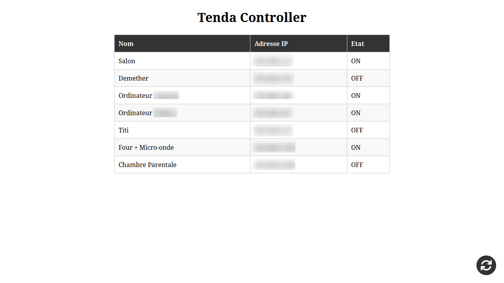
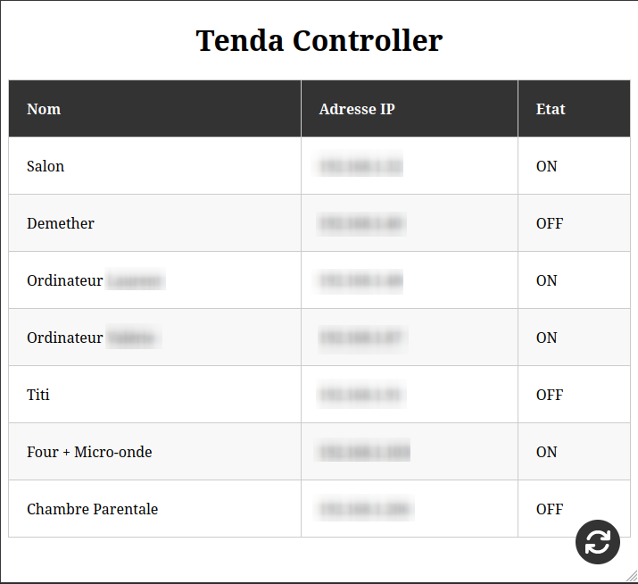
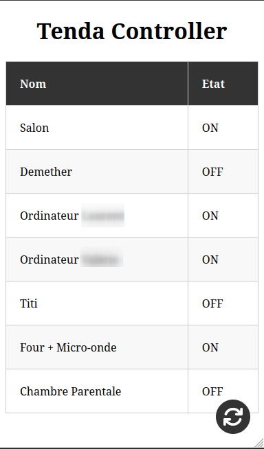
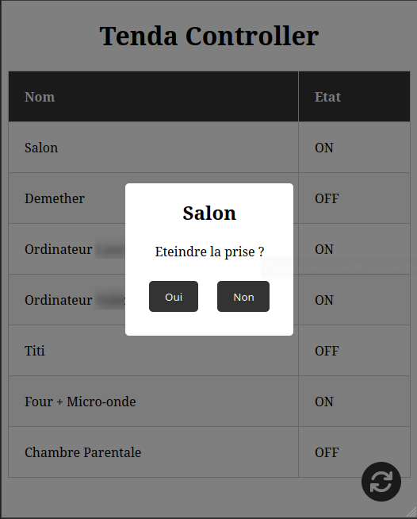
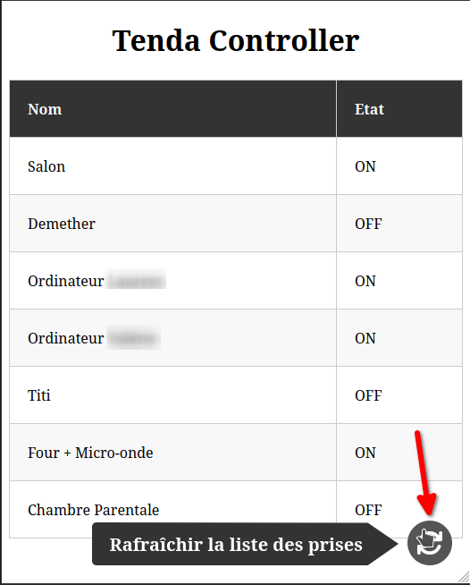

# Tenda SP9 Controller
This is a simple controller for the Tenda SP9 smart plug. Thanks to [rex_3](https://community.home-assistant.io/t/tenda-beli-sp9/452705/2) for providing the endpoints of the plugs.

## Installation
### Requirements
- Python 3
- Pip
- Git
### Steps
1) Clone the repository
```bash
git clone
```
2) Install the requirements
```bash
pip install -r requirements.txt
```
3) Run the script
```bash
python3 tenda_controller.py
```

## Usage
To use the script, run the following command:
```bash
python3 tenda_controller.py
```
If it does not work, try with `python` or `py` instead of `python3`.
The script is a web server that listens on port 8080.

## How does it work?
The script sees if `plugs.json` does exist (this is were IP addresses and names of the plugs are stored). If it does not exist the script will run another script (`tenda_scraper.py`) and wait for it to finish.

After this, we do have all IP addresses needed to control the plugs. The script will then start a web server that listens on port 8080. The web server has 3 endpoints:
- `/` - This is the main page. It shows all plugs and their status. By clicking on the row a modal will pop up that allows you to toogle the plug.
- `/toggle` - This endpoint is used to toggle a plug. This one is used "in background" by the main page. The ip is in the url as `/toogle/<ip>`.
- `/refresh` - This endpoint refresh `plugs.json` and reloads the main page. This is used when you add, remove or when the IP address of a plug changes.

## I am in the main page, what do I do?
1) The main page shows all plugs and their status.
2) By clicking on the row of a plug a modal will pop up that allows you to toogle the plug.
3) At the bottom of the page there is a button that allows you to refresh all the plugs found to get all newly accessible plugs (it changes only the `.json` file and not the plugs).

## I refresh but one or multiple plugs are missing
Right, this is because the script only looks for plugs that are on the same network as the computer/server running the script. So, if you have a plug that is not on the same network as the computer/server running the script, it will not be found. To fix this, you can add the IP address of the plug to `plugs.json` manually.

It can also happen when a plug is bugged and need to be reset. To do this, hold the button on the plug for 10 seconds (unplugging until there is no led anymore works too). After this, the plug will be reset. Its possible that you will need to configure the plug again using the Tenda app. When the plug is OK (when the light is blue, and not blinking) you can click on the refresh button in the main page or add the IP address of the plug to `plugs.json` manually.

## I want to add a plug
After the plug is rightly configured and at least accessible from the computer/server running the script, you can click on the refresh button in the main page or add the IP address of the plug to `plugs.json` manually.

## I want to remove a plug
Unplug the plug and click on the refresh button in the main page or remove the IP address of the plug from `plugs.json` manually.

## I want to change the name of a plug
Change the name of the plug via the Tenda app or ultimatly change the name in `plugs.json` manually.

## Screenshots
### On Computer (PC)

### On Tablet

### On Phone

### Modal

### Refresh

